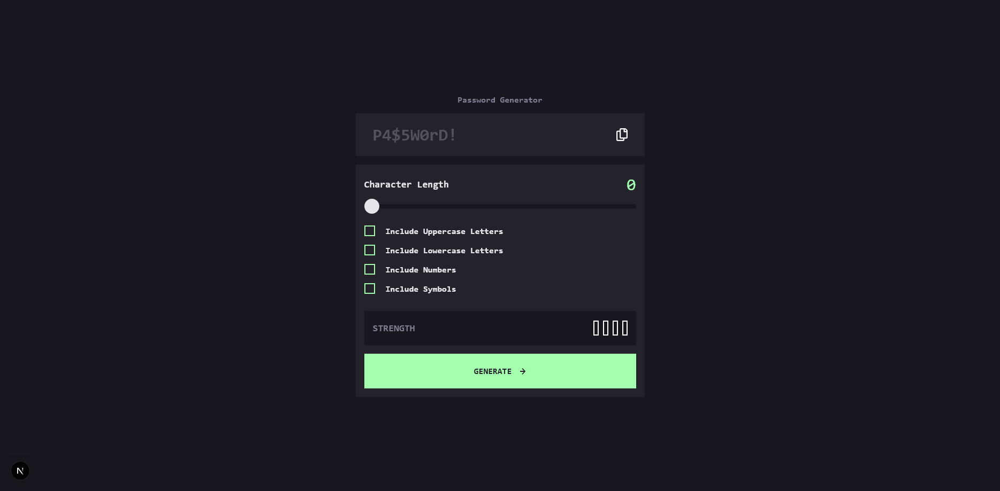
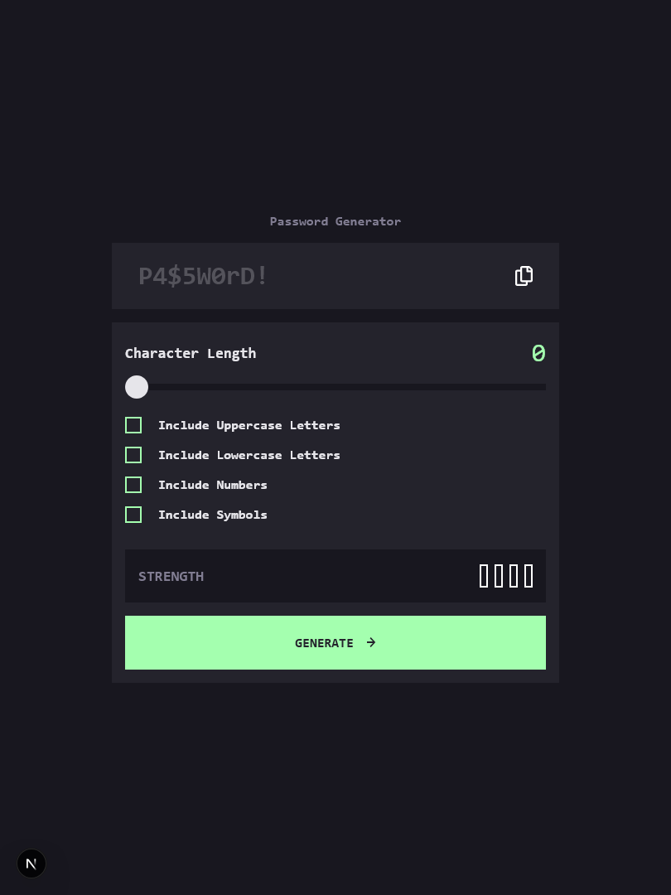
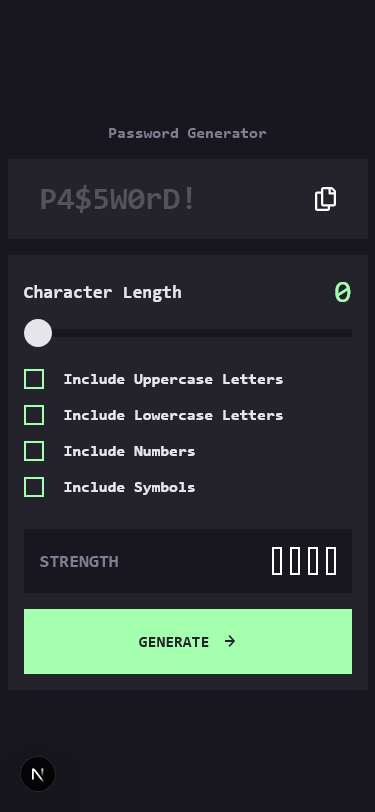

# Frontend Mentor - Password generator app solution

This is a solution to the [Password generator app challenge on Frontend Mentor](https://www.frontendmentor.io/challenges/password-generator-app-Mr8CLycqjh). Frontend Mentor challenges help you improve your coding skills by building realistic projects.

## Table of contents

- [Overview](#overview)
  - [The challenge](#the-challenge)
  - [Screenshot](#screenshot)
  - [Links](#links)
- [My process](#my-process)
  - [Built with](#built-with)
  - [What I learned](#what-i-learned)
  - [Useful resources](#useful-resources)
- [Author](#author)

## Overview

### The challenge

Users should be able to:

- Generate a password based on the selected inclusion options
- Copy the generated password to the computer's clipboard
- See a strength rating for their generated password
- View the optimal layout for the interface depending on their device's screen size
- See hover and focus states for all interactive elements on the page

### Screenshot

### Links

- Solution URL: [Github](https://github.com/imvan2/frontend-mentor/tree/main/intermediate/password-generator-app)
- Live Site URL: [Live Site](https://frontend-mentor-effzl6hny-van-tus-projects.vercel.app/)

## My process

### Built with

- Tailwind
- TypeScript
- Mobile-first workflow
- [Next.js](https://nextjs.org/) - React framework

### What I learned

I learned 

### Useful resources

-  - This helped me change input range styles and understand how difficult it is to change what looks simple!
-  - This is an article that taught me the differences between \_app.js and \_document.js
-  - This helped me change input checkbox styles.

## Author

- LinkedIn - [Van Tu](https://www.linkedin.com/in/van-tu/)
- Frontend Mentor - [@imvan2](https://www.frontendmentor.io/profile/imvan2)
