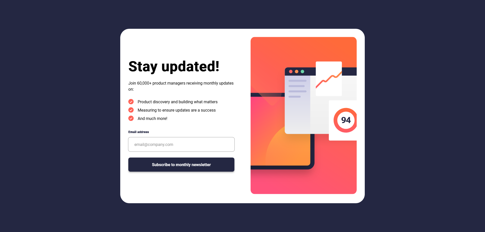
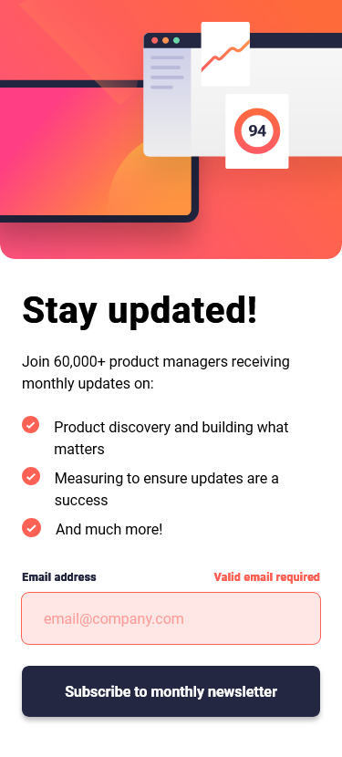
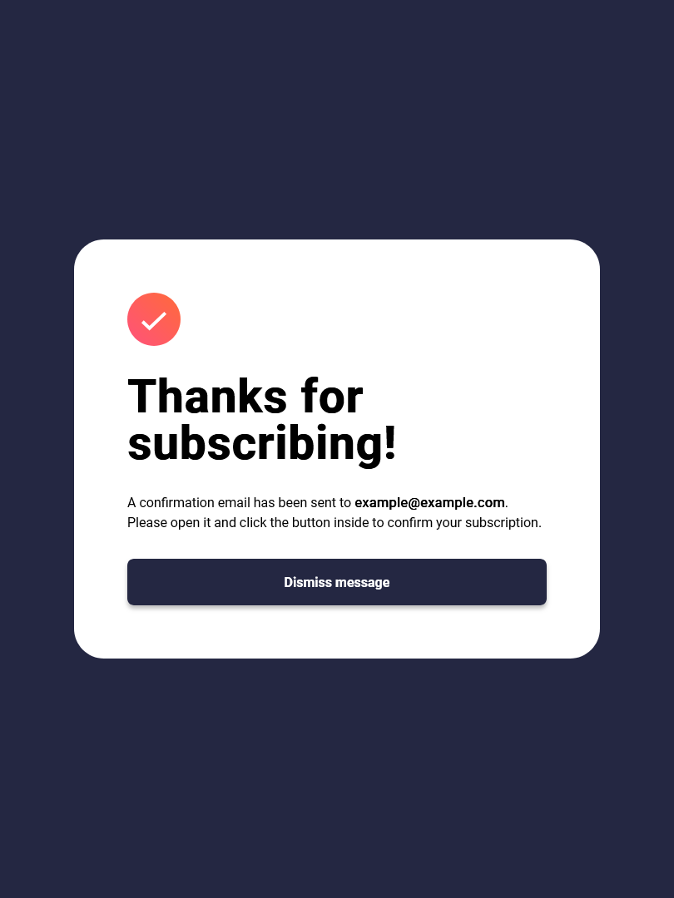

# Frontend Mentor - Newsletter sign-up form with success message solution

This is a solution to the [Newsletter sign-up form with success message challenge on Frontend Mentor](https://www.frontendmentor.io/challenges/newsletter-signup-form-with-success-message-3FC1AZbNrv). Frontend Mentor challenges help you improve your coding skills by building realistic projects.

## Table of contents

- [Overview](#overview)
  - [The challenge](#the-challenge)
  - [Screenshot](#screenshot)
  - [Links](#links)
- [My process](#my-process)
  - [Built with](#built-with)
  - [What I learned](#what-i-learned)
  - [Useful resources](#useful-resources)
- [Author](#author)

## Overview

### The challenge

Users should be able to:

- Add their email and submit the form
- See a success message with their email after successfully submitting the form
- See form validation messages if:
  - The field is left empty
  - The email address is not formatted correctly
- View the optimal layout for the interface depending on their device's screen size
- See hover and focus states for all interactive elements on the page

### Screenshot

### Links

- Solution URL: [Github](https://github.com/imvan2/frontend-mentor/tree/main/junior/newsletter-signup-form)
- Live Site URL: [Live Site](https://imvan2.github.io/frontend-mentor/junior/newsletter-signup-form/)

## My process

### Built with

- Semantic HTML5 markup
- CSS custom properties
- SASS/SCSS
- Flexbox
- CSS Grid
- Mobile-first workflow
- Vanilla JavaScript

### What I learned

I learned what accessible HTML looks like and refreshed my JS skills for forms.

### Useful resources

- [Adding ttf to SASS](https://stackoverflow.com/questions/41747557/how-to-add-a-ttf-font-file-from-web-in-sass-to-be-displayed-in-haml) - This helped me add a ttf font file to sass.
- [MDN Role](https://developer.mozilla.org/en-US/docs/Web/Accessibility/ARIA/Reference/Roles/alert_role) - This helped me with web accessibility.
- [ARIA Alert](https://www.a11y-collective.com/blog/aria-alert/#:~:text=Place%20your%20role%3D%22alert%22,screen%20readers%20catch%20the%20change.) - This helped me understand how to use ARIA Alerts effectively.

## Author

- LinkedIn - [Van Tu](https://www.linkedin.com/in/van-tu/)
- Frontend Mentor - [@imvan2](https://www.frontendmentor.io/profile/imvan2)
