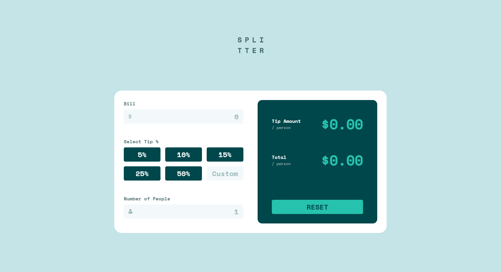
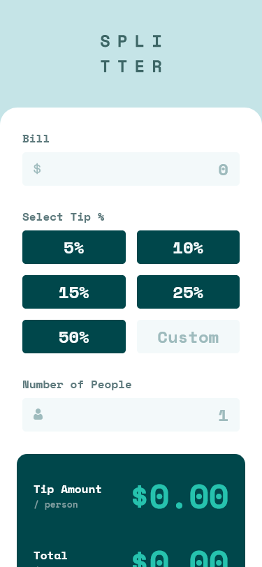
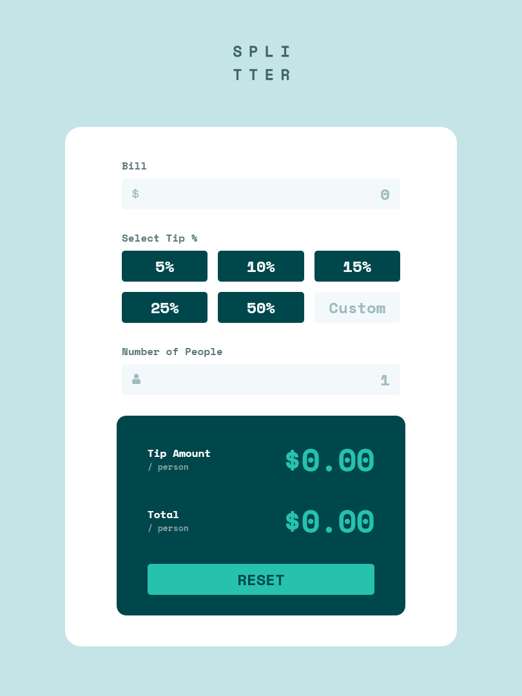

# Frontend Mentor - Tip calculator app solution

This is a solution to the [Tip calculator app challenge on Frontend Mentor](https://www.frontendmentor.io/challenges/tip-calculator-app-ugJNGbJUX). Frontend Mentor challenges help you improve your coding skills by building realistic projects.

## Table of contents

- [Overview](#overview)
  - [The challenge](#the-challenge)
  - [Screenshot](#screenshot)
  - [Links](#links)
- [My process](#my-process)
  - [Built with](#built-with)
  - [What I learned](#what-i-learned)
  - [Useful resources](#useful-resources)
- [Author](#author)

## Overview

### The challenge

Users should be able to:

- View the optimal layout for the app depending on their device's screen size
- See hover states for all interactive elements on the page
- Calculate the correct tip and total cost of the bill per person

### Screenshot

### Links

- Solution URL: [Github](https://github.com/imvan2/frontend-mentor/tree/main/junior/tip-calculator-app)
- Live Site URL: [Live Site](https://imvan2.github.io/frontend-mentor/junior/tip-calculator-app/)

## My process

### Built with

- Semantic HTML5 markup
- CSS custom properties
- SASS/SCSS
- Flexbox
- CSS Grid
- Mobile-first workflow
- JavaScript

### What I learned

I solidified my understanding of SCSS and responsive styles, and polished my JS skills!

### Useful resources

- [CSS Reset](https://www.joshwcomeau.com/css/custom-css-reset/) - This helped me understand what CSS reset styles to use.

## Author

- LinkedIn - [Van Tu](https://www.linkedin.com/in/van-tu/)
- Frontend Mentor - [@imvan2](https://www.frontendmentor.io/profile/imvan2)
