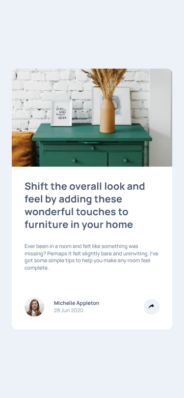

# Frontend Mentor - Article preview component solution

This is a solution to the [Article preview component challenge on Frontend Mentor](https://www.frontendmentor.io/challenges/article-preview-component-dYBN_pYFT). Frontend Mentor challenges help you improve your coding skills by building realistic projects.

## Table of contents

- [Overview](#overview)
  - [The challenge](#the-challenge)
  - [Screenshot](#screenshot)
  - [Links](#links)
- [My process](#my-process)
  - [Built with](#built-with)
  - [What I learned](#what-i-learned)
  - [Useful resources](#useful-resources)
- [Author](#author)

## Overview

### The challenge

Users should be able to:

- View the optimal layout for the component depending on their device's screen size
- See the social media share links when they click the share icon

### Screenshot

### Links

- Solution URL: [Github](https://github.com/imvan2/frontend-mentor/tree/main/newbie/article-preview-component)
- Live Site URL: [Live](https://imvan2.github.io/frontend-mentor/newbie/article-preview-component/)

## My process

### Built with

- Semantic HTML5 markup
- SASS/SCSS
- CSS custom properties
- Flexbox
- CSS Grid
- Mobile-first workflow
- Javascript (without a framework)

### What I learned

I learned best practices using JS and polished up my JS skills.

### Useful resources

- [Include vs Extend in SASS](https://stackoverflow.com/questions/45899894/when-to-use-extend-and-mixin-in-sass) - This helped me clarify when to use mixins vs inheritance.
- [SASS/SCSS](https://sass-lang.com/guide/#inheritance) - This helped me with SASS/SCSS.

## Author

- LinkedIn - [Van Tu](https://www.linkedin.com/in/van-tu/)
- Frontend Mentor - [@imvan2](https://www.frontendmentor.io/profile/imvan2)
