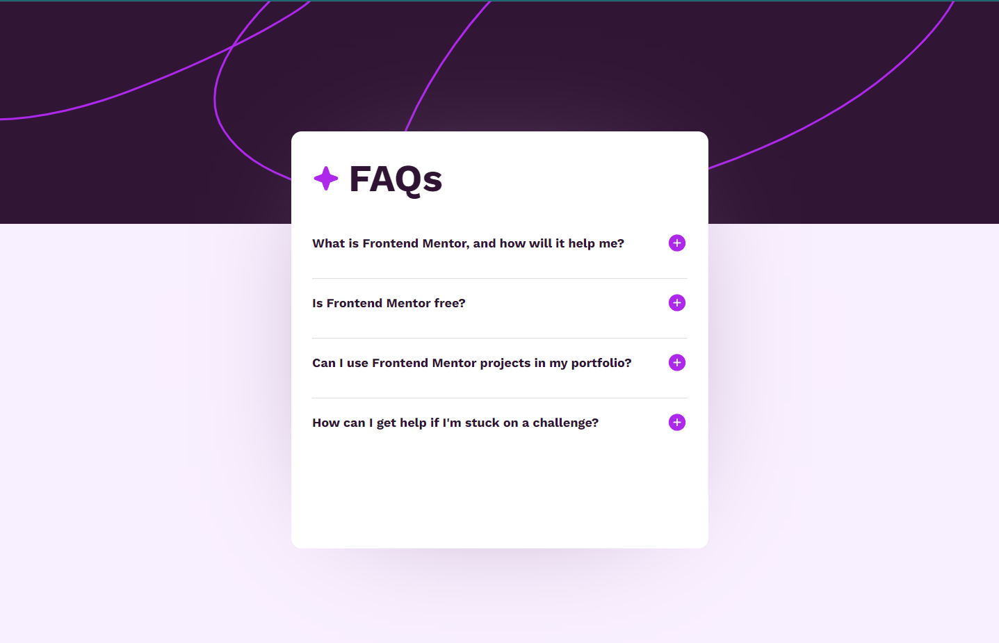
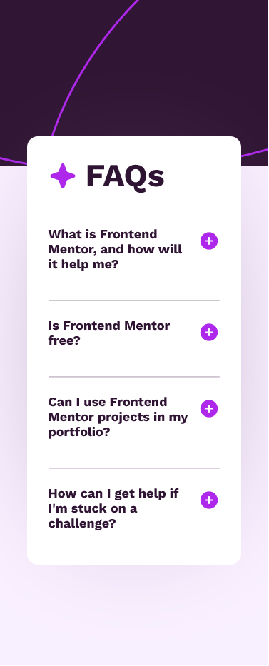

# Frontend Mentor - FAQ accordion solution

This is a solution to the [FAQ accordion challenge on Frontend Mentor](https://www.frontendmentor.io/challenges/faq-accordion-wyfFdeBwBz). Frontend Mentor challenges help you improve your coding skills by building realistic projects.

## Table of contents

- [Overview](#overview)
  - [The challenge](#the-challenge)
  - [Screenshot](#screenshot)
  - [Links](#links)
- [My process](#my-process)
  - [Built with](#built-with)
  - [What I learned](#what-i-learned)
  - [Useful resources](#useful-resources)
- [Author](#author)

## Overview

https://www.svgbackgrounds.com/tools/svg-to-css/

### The challenge

Users should be able to:

- Hide/Show the answer to a question when the question is clicked
- Navigate the questions and hide/show answers using keyboard navigation alone
- View the optimal layout for the interface depending on their device's screen size
- See hover and focus states for all interactive elements on the page

### Screenshot




### Links

- Solution URL: [Github](https://github.com/imvan2/FAQ-Accordion)
- Live Site URL: [Live Site](https://imvan2.github.io/FAQ-Accordion/)

## My process

I first stylized the page by using CSS and HTML. I added the first few basics, such as color, font, background image, etc. Then, I used React to create the accordion effect and to switch between the different button icons when clicked. Once I made sure the accordion was working correctly, I then finalized the rest of the stylings, such as mobile view.

### Built with

- Semantic HTML5 markup
- CSS custom properties
- [React](https://reactjs.org/) - JS library

### What I learned

Use this section to recap over some of your major learnings while working through this project. Writing these out and providing code samples of areas you want to highlight is a great way to reinforce your own knowledge.

To see how you can add code snippets, see below:

- How to move a container over an image:
```css
.container {
  position: absolute;
  top: 50px;
  bottom: 0;
  right: 0;
  left: 0;
}
```

- How to make two siblings sit next to each other when their feature is to cover entire row:
```css
.star-logo,
.title {
  display: inline-block;
  vertical-align: middle;
}
```

### Useful resources

- [CSS Position Relative VS Absolute](https://kolosek.com/css-position-relative-vs-position-absolute/) - This helped me figure out the difference between relative and absolute and when to use them.
- [SVG to CSS Converter](https://www.svgbackgrounds.com/tools/svg-to-css/) - This is what I used to convert SVG into CSS so I can insert a background image in the CSS file.

## Author

- Website - [Github](https://github.com/imvan2)
- Frontend Mentor - [@imvan2](https://www.frontendmentor.io/profile/imvan2)