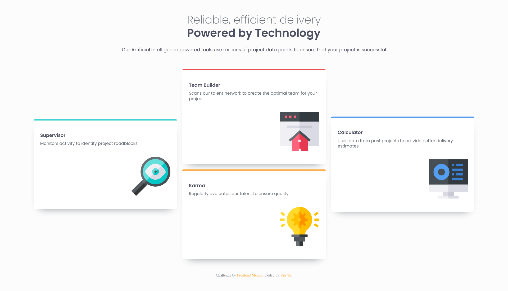
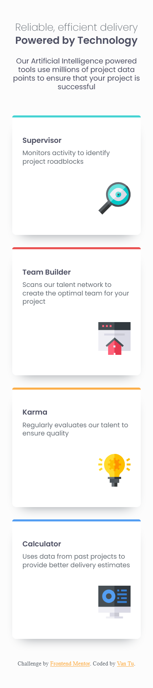

# Frontend Mentor - Four card feature section solution

This is a solution to the [Four card feature section challenge on Frontend Mentor](https://www.frontendmentor.io/challenges/four-card-feature-section-weK1eFYK). Frontend Mentor challenges help you improve your coding skills by building realistic projects.

## Table of contents

- [Overview](#overview)
  - [The challenge](#the-challenge)
  - [Screenshot](#screenshot)
  - [Links](#links)
- [My process](#my-process)
  - [Built with](#built-with)
  - [What I learned](#what-i-learned)
  - [Useful resources](#useful-resources)
- [Author](#author)

## Overview

### The challenge

Users should be able to:

- View the optimal layout for the site depending on their device's screen size

### Screenshot

### Links

- Solution URL: [Github](https://github.com/imvan2/four-card-feature)
- Live Site URL: [Live](https://imvan2.github.io/four-card-feature/)

## My process

### Built with

- Semantic HTML5 markup
- SCSS/SASS
- CSS custom properties
- Flexbox
- CSS Grid
- Mobile-first workflow

### What I learned

Solidifying my knowledge of SCSS/SASS.

### Useful resources

- [SCSS/SASS](https://sass-lang.com/guide/) - This helped me learn SCSS/SASS.
- [CSS Grid](https://css-tricks.com/snippets/css/complete-guide-grid/) - This site helped with me CSS grid.

## Author

- LinkedIn - [Van Tu](https://www.linkedin.com/in/van-tu/)
- Frontend Mentor - [@imvan2](https://www.frontendmentor.io/profile/imvan2)
