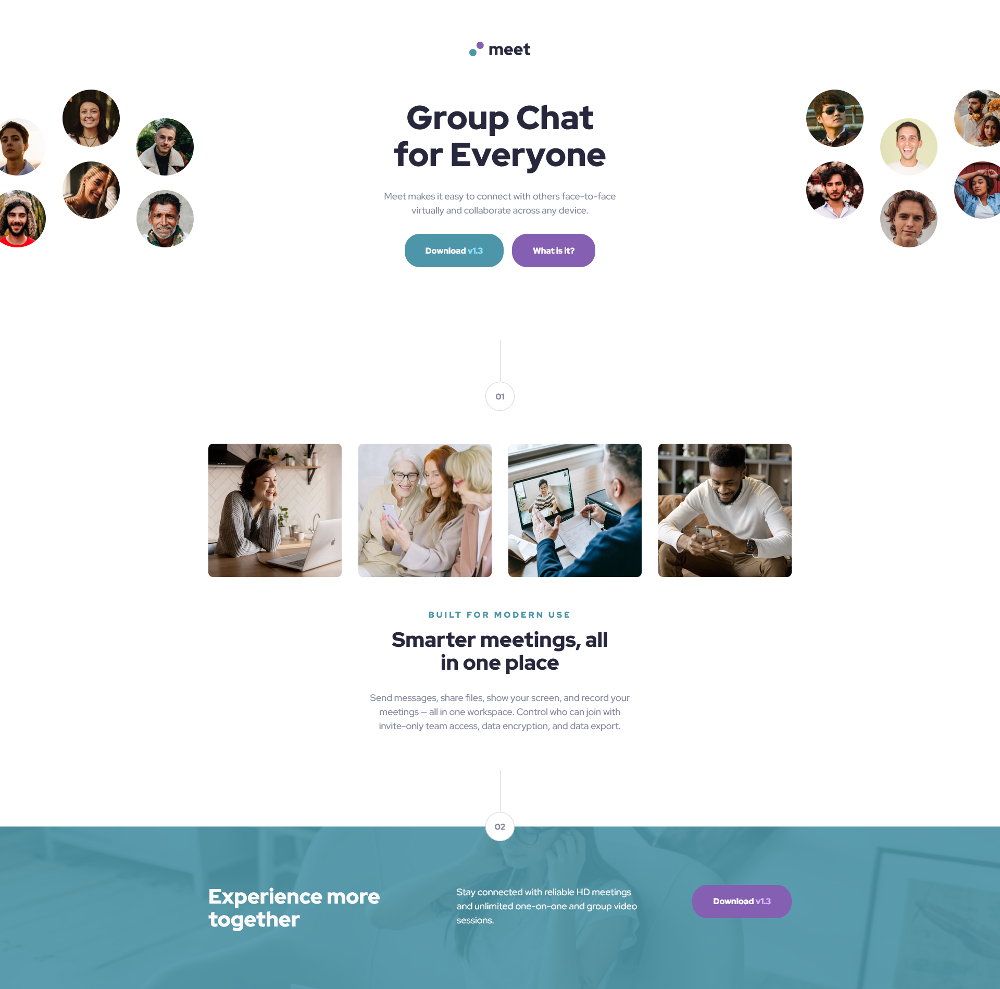
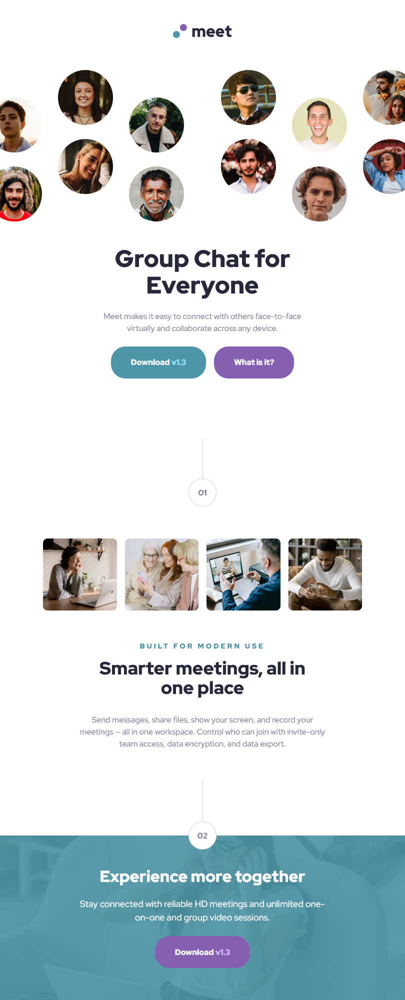

# Frontend Mentor - Meet landing page solution

This is a solution to the [Meet landing page challenge on Frontend Mentor](https://www.frontendmentor.io/challenges/meet-landing-page-rbTDS6OUR). Frontend Mentor challenges help you improve your coding skills by building realistic projects.

## Table of contents

- [Overview](#overview)
  - [The challenge](#the-challenge)
  - [Screenshot](#screenshot)
  - [Links](#links)
- [My process](#my-process)
  - [Built with](#built-with)
  - [Useful resources](#useful-resources)
- [Author](#author)

## Overview

### The challenge

Users should be able to:

- View the optimal layout depending on their device's screen size
- See hover states for interactive elements

### Screenshot

### Links

- Solution URL: [Github](https://github.com/imvan2/frontend-mentor/tree/main/newbie/meet-landing-page)
- Live Site URL: [Live Site](https://imvan2.github.io/frontend-mentor/newbie/meet-landing-page/)

## My process

### Built with

- Semantic HTML5 markup
- SASS/SCSS
- CSS custom properties
- Flexbox
- CSS Grid
- Mobile-first workflow

### What I learned

I solified my understanding of SASS/SCSS, as well as learning how to manipulate layouts using CSS grid.

### Useful resources

- [SASS/SCSS](https://sass-lang.com/guide/#inheritance) - This helped me understand SASS/SCSS.
- [CSS Grid](https://css-tricks.com/snippets/css/complete-guide-grid/) - This is helped me understand CSS Gird.
- [CSS Grid with nested divs](https://stackoverflow.com/questions/48224237/css-grid-with-nested-div-structure) - This helped me manipulate the header into different layouts.

## Author

- Website - [Van Tu](https://www.linkedin.com/in/van-tu/)
- Frontend Mentor - [@imvan2](https://www.frontendmentor.io/profile/imvan2)
